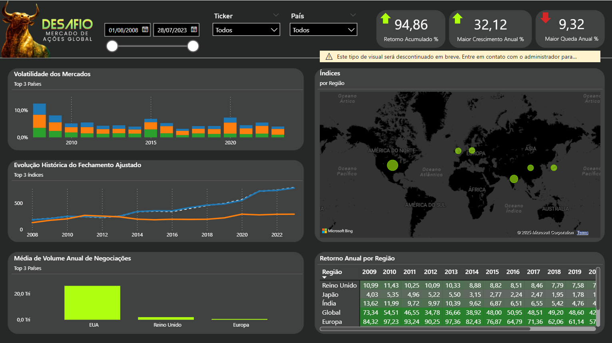

# 📊 Dashboard Global Stock Markets (2008–2023)

Este repositório contém um dashboard desenvolvido no **Power BI** para análise dos principais mercados de ações globais entre **2008 e 2023**.  
O projeto foi realizado como parte de um desafio de **visualização de dados**, combinando métricas financeiras clássicas com boas práticas de Business Intelligence.

---

## 📈 Objetivo
O dashboard busca responder a três pilares da análise de mercados financeiros:  
- **Retorno** → Como os índices evoluíram ao longo do tempo.  
- **Risco** → Quais mercados apresentaram maior volatilidade.  
- **Liquidez** → Onde ocorreram os maiores volumes de negociações.  

---

## 📂 Estrutura do Repositório
├── data/

│ └── sample_data.csv # Amostra dos dados usados

│

├── docs/

│ ├── dashboard_preview.png # Captura de tela do dashboard

│ └── kpis_explanation.md # Explicação detalhada dos KPIs

│

├── dashboard.pbit # Template do Power BI (sem dados)

└── README.md # Documentação principal

---

## 📈 Dados Utilizados
A base consolidada contém informações de índices e ações de diferentes regiões do mundo, com os seguintes campos principais:

- **Ticker** → Código do índice/ação  
- **Date** → Data da negociação  
- **Open** → Preço de abertura  
- **High** → Preço máximo do período  
- **Low** → Preço mínimo do período  
- **Close** → Preço de fechamento  
- **Adj Close** → Preço de fechamento ajustado  
- **Volume** → Volume de negociações  

---

## 🏆 KPIs
Os KPIs utilizados neste projeto estão documentados separadamente para detalhar:  
- Definições  
- Fórmulas em DAX  
- Interpretação no contexto de mercado de ações  

📑 [Explicação detalhada dos KPIs](docs/kpis_explanation.pdf)   

---

## 📊 Análises Incluídas
O painel contém as seguintes visualizações:  
- **Top 3 países com maiores percentuais de volatilidade** → colunas empilhadas para destacar os mercados mais instáveis.  
- **Evolução histórica do preço de fechamento ajustado** → gráfico de linha mostrando tendências e crises.  
- **Top 3 países com maiores médias de volume anual de negociações** → gráfico de colunas para evidenciar os mercados mais líquidos.  
- **Retorno anual por região** → matriz com formatação condicional para identificar ciclos econômicos.  
- **Mapa com distribuição de índices por região** → visão geográfica da representatividade dos mercados.  

---

## 🎨 Paleta de Cores
Foi utilizada uma paleta de 5 cores distintas para diferenciar os países e tickers analisados:

- Azul (`#1F77B4`)  
- Laranja (`#FF7F0E`)  
- Verde (`#2CA02C`)  
- Verde neon (`#AFFF10`)   
- Branco (`FFFFFF`)

---

## 🚀 Como Utilizar
1. Baixe o arquivo **dashboard.pbit**  
2. Abra no **Power BI Desktop** (gratuito)  
3. Conecte-se à base de dados (ou use a amostra disponível em `/data`)  
4. Explore os filtros por **Ano, Região e Índice**  

---

## 📌 Observações
- Os dados são históricos e públicos  
- O foco do projeto é **clareza visual + KPIs financeiros clássicos**

---

## 📝 Consideração Final
Desenvolver este dashboard foi uma experiência muito enriquecedora.  
O maior desafio esteve em **sintetizar informações de diversos países e tickers**, já que a grande quantidade de dados dificultava a clareza visual das análises.  
Como solução, optei por **destacar apenas os três maiores índices em cada gráfico**, garantindo uma apresentação mais **limpa, direta e sem poluição visual**, ao mesmo tempo em que mantive a relevância das informações.  

